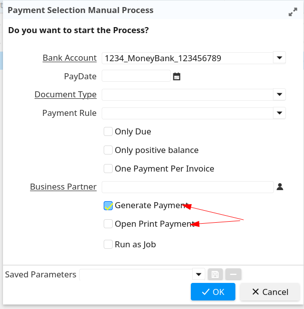

## Purpose
The purpose of this plugin is to replace the Payment Selection (Manual) with an Info Window (also named Payment Selection (Manual)).

## Install
1. Use the packin file `za.co.ntier.payment/2pack/za.co.ntier.payment.zip`.
2. Install this plugin.
3. Log in to the client and go to the menu to open the info window Payment Selection (Manual).


## Some gaps when converting
### Info window does not support context variables well in the where clause
When the Info Window initializes, it parses the where clause and keeps it parsed. After that, it concatenates with the condition from the info parameter, so the where clause can contain global context variables, not info context variables.

From `PaySelect.prepareTable`, you can get the where clause:
```sql
"i.IsSOTrx=? AND IsPaid='N'"
            + " AND invoiceOpenToDate(i.C_Invoice_ID, i.C_InvoicePaySchedule_ID, SysDate) != 0" // Check that AmountDue <> 0
            // Different Payment Selection
            + " AND (i.C_InvoicePaySchedule_ID > 0 OR NOT EXISTS (SELECT * FROM C_PaySelectionLine psl"
            +                 " INNER JOIN C_PaySelectionCheck psc ON (psl.C_PaySelectionCheck_ID=psc.C_PaySelectionCheck_ID)"
            +                 " LEFT OUTER JOIN C_Payment pmt ON (pmt.C_Payment_ID=psc.C_Payment_ID)"
            +                 " WHERE i.C_Invoice_ID=psl.C_Invoice_ID AND psl.IsActive='Y'"
            +				  " AND (pmt.DocStatus IS NULL OR pmt.DocStatus NOT IN ('VO','RE')) ))"
            + " AND i.DocStatus IN ('CO','CL')"
            + " AND i.AD_Client_ID=?",	// additional where & order in loadTableInfo()
```
```i.IsSOTrx=?``` needs to be appended in another way. In `InfoPaymentSelectionWindow`, I override `getSQLWhere` to do that.

### Info window does not support context variables well in the info column "Sql SELECT"
The column `DiscountAmt` (and some other columns) in `PaySelection.prepareTable` is defined by SQL:
```sql
currencyConvert(invoiceDiscount(i.C_Invoice_ID,?,i.C_InvoicePaySchedule_ID),i.C_Currency_ID, ?,?,i.C_ConversionType_ID, i.AD_Client_ID,i.AD_Org_ID)
```
When converting the form to an info window, use "Sql SELECT" and replace the parameter with a context variable:
```sql
currencyConvert(invoiceDiscount(i.C_Invoice_ID,@PayDate@,i.C_InvoicePaySchedule_ID),i.C_Currency_ID, @C_Currency_ID@,@PayDate@,i.C_ConversionType_ID, i.AD_Client_ID,i.AD_Org_ID)
```
The context variable in "sql select" is evaluated when `executeQuery` is called, so it supports the info parameter well. However, when saving the info column, it validates by replacing the context variable with 0 and testing the SQL, which causes issues with the date. This is explained here: [IDEMPIERE-6419](https://github.com/idempiere/idempiere/pull/2675#issuecomment-2641519196).

I finally resolved this by using two changes:
1. Declare a new global context variable `#TimeStampFormat` as the time format used to convert a string to a timestamp.
2. Change the SQL parameter to `TO_TIMESTAMP(NULLIF('@PayDate:null@', 'null')`.

The expression becomes:
```sql
currencyConvert(invoiceDiscount(i.C_Invoice_ID,TO_TIMESTAMP(NULLIF('@PayDate:null@', 'null'), '@#TimeStampFormat@'),i.C_InvoicePaySchedule_ID),i.C_Currency_ID, @C_Currency_ID:0@,TO_TIMESTAMP(NULLIF('@PayDate:null@', 'null'), '@#TimeStampFormat@'),i.C_ConversionType_ID, i.AD_Client_ID,i.AD_Org_ID)
```

### Payment Selection has some dynamic parameters (PaySelection.loadTableInfo)
The payment selection form has some special parameters.

Some are not directly chosen on the form; they depend on the value of other parameters with some logic (`isSOTrx`):
```java
String isSOTrx = "N";
        if (paymentRule != null && X_C_Order.PAYMENTRULE_DirectDebit.equals(paymentRule.getValue()))
        {
            isSOTrx = "Y";
            sql += " AND i.PaymentRule='" + X_C_Order.PAYMENTRULE_DirectDebit + "'";
        }
```
Some are chosen from the form but with extra logic (`onlyPositiveBalance`, `paymentRule`):
```java
if (onlyPositiveBalance) {
            int innerindex = sql.indexOf("INNER");
            String subWhereClause = sql.substring(innerindex, sql.length());

            // Replace original aliases with new aliases
            subWhereClause = subWhereClause.replaceAll("\\bi\\b", "i1");
            subWhereClause = subWhereClause.replaceAll("\\bbp\\b", "bp1");
            subWhereClause = subWhereClause.replaceAll("\\bc\\b", "c1");
            subWhereClause = subWhereClause.replaceAll("\\bp\\b", "p1");
            subWhereClause = subWhereClause.replaceAll("\\bpsl\\b", "psl1");
            subWhereClause = subWhereClause.replaceAll("\\bpsc\\b", "psc1");
            subWhereClause = subWhereClause.replaceAll("\\bpmt\\b", "pmt1");

            sql += " AND i.c_bpartner_id NOT IN ( SELECT i1.C_BPartner_ID"
                    + " FROM C_Invoice_v i1 "
                    + subWhereClause
                    + " GROUP BY i1.C_BPartner_ID"
                    + " HAVING sum(invoiceOpen(i1.C_Invoice_ID, i1.C_InvoicePaySchedule_ID)) <= 0) ";
        }
```
Some are chosen from the form but are used to choose column values in the select, not as conditions in the where clause (`PayDate`).
Some are chosen from the form but are used to load other parameters, not directly used in the query (`Bank Account`).
Some are chosen from the form but are not used for the query; they control process logic (`One Payment Per Invoice`).

To convert these kinds of parameters, I use some techniques:
1. In "Sql SELECT", fill 0 so this parameter only updates the value to the context variable and does not affect the final query.
2. Override `getSQLWhere` to append conditions in the where clause depending on the value of the context variable.
3. Use the context variable in "Sql SELECT" to manipulate query data (`PayDate`).

### Payment Selection has some labels to display extra values (Current balance)
I use quick info to display it, but the main context only updates when `executeQuery` is called; it does not update when changing parameters. Quick info is not called to update when changing parameters, so I need to override `InfoWindow.valueChange` to improve it.

### Confirm when running the process
The payment selection form runs some code on event handling and calls a process. It shows some dialogs to ask the user what they should do.


The info window does everything in one process, so I move that confirmation to the process parameter dialog.



## What Inside Plugin

### Event Handling
Handles login to set some global variables in [LoginEventDelegate](/src/za/co/ntier/payment/event/delegate/LoginEventDelegate.java):
- `TimeStampFormat` to format date when converting string to timestamp.
- `MSysConfig.PAYMENT_SELECTION_MANUAL_ASK_INVOKE_GENERATE` to apply display logic to the process parameter dialog.

### Info Class
Overrides some functionality from `InfoWindow` in [InfoPaymentSelectionWindow](/src/za/co/ntier/payment/info/InfoPaymentSelectionWindow.java).

### Payment Selection Process
Handles the payment selection process in [PaymentSelectionManualProcess](/src/za/co/ntier/payment/process/PaymentSelectionManualProcess.java).

### Factory Class
Located inside [factorys](/src/za/co/ntier/payment/osgi/component)